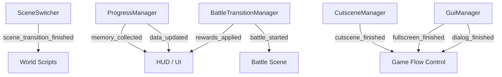
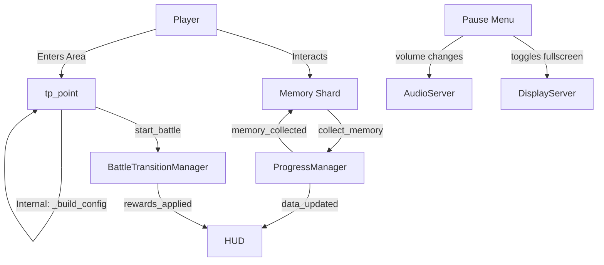
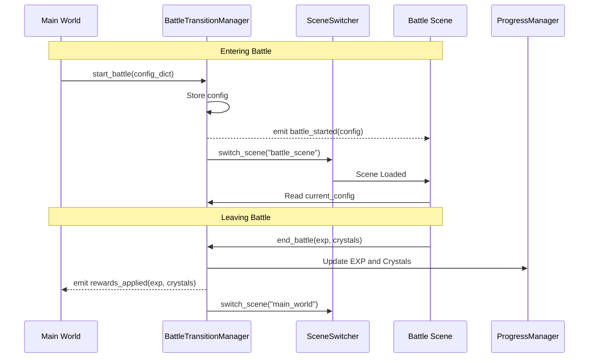
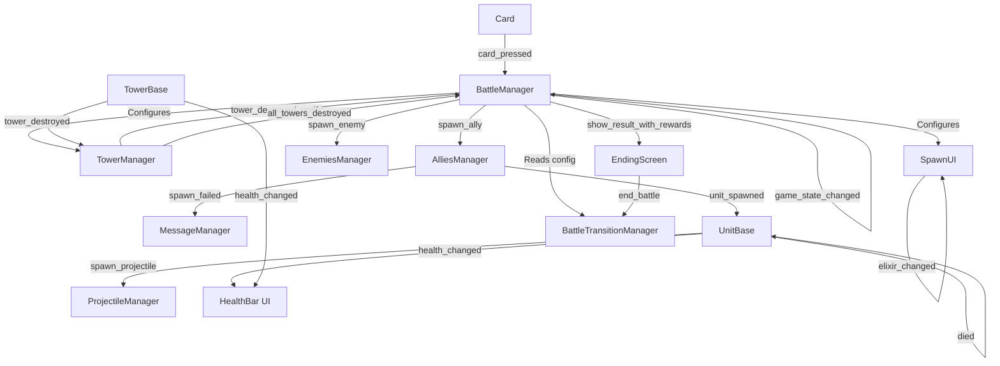
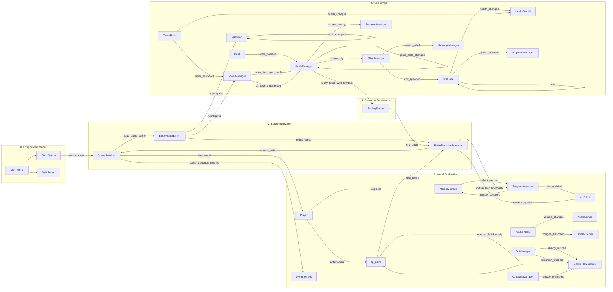

# Game Architecture and Signal Interactions

This document maps out the interactions between the different scripts and systems in the game, categorized by their main components and stages.

## 1. Global Autoloads & Managers Flow

These systems operate globally and manage the core state and transitions of the game.

## 2. Main World & Progression Flow

This flow covers how the player interacts with the world, triggers cutscenes, and collects items.

## 3. Battle Transition Flow

This details the specific bidirectional transition between the RPG World and the Battle Scene.

## 4. Battle Scene Internal Flow

This flow maps out the complex internal interactions and signals within the Battle Scene during gameplay.

## 5. Full System Interaction Map (Chronological Flow)

This unified graph maps the game's architecture based on the player's progression through time, from the Main Menu to the Battle results.

