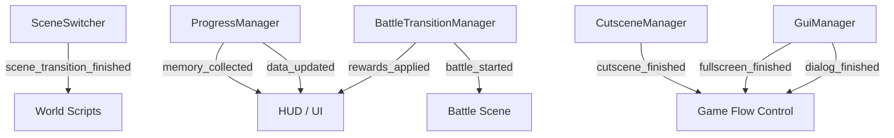
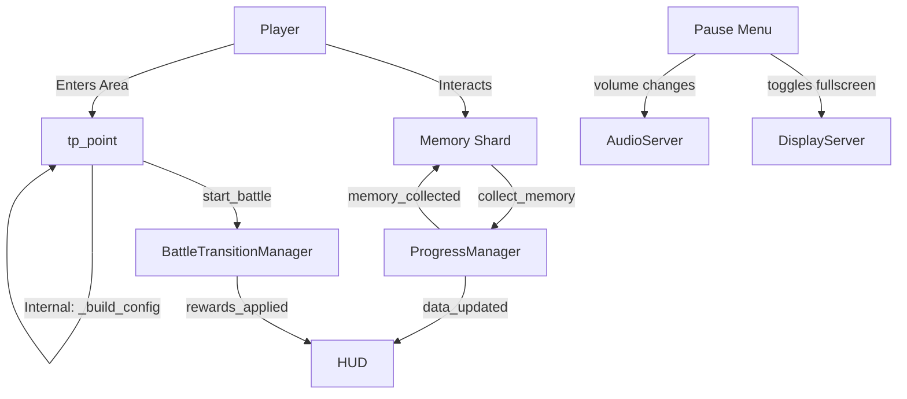
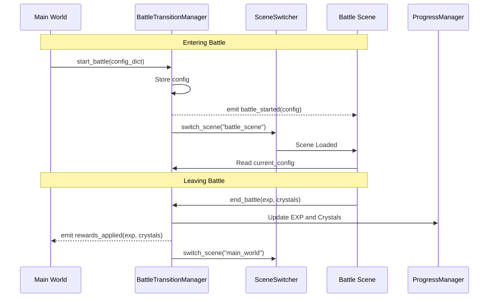
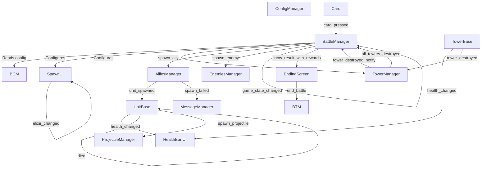
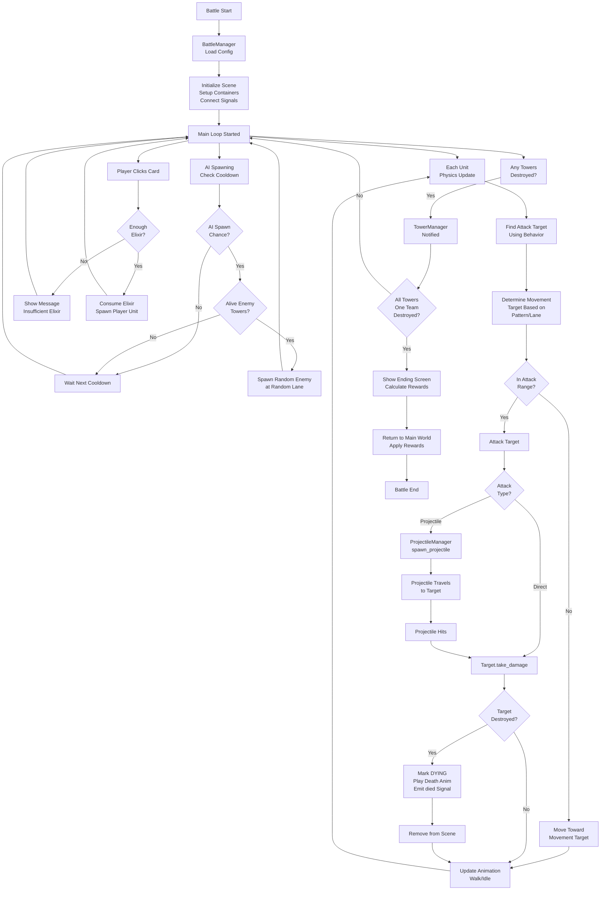
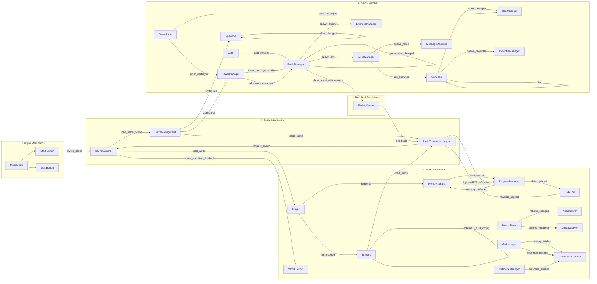

# Project Terminus - Complete System Architecture

This document provides a comprehensive overview of the entire game architecture, including system interactions, signal flows, and detailed component documentation.

---

## 1. Global Autoloads & Managers Flow

These systems operate globally and manage the core state and transitions of the game.



---

## 2. Main World & Progression Flow

This flow covers how the player interacts with the world, triggers cutscenes, and collects items.



---

## 3. Battle System Architecture

### 3.1 Battle Transition Flow

This details the specific bidirectional transition between the RPG World and the Battle Scene.



### 3.2 Battle Scene Internal Flow

This flow maps out the complex internal interactions and signals within the Battle Scene during gameplay.



---

## 4. Core System Components

### 4.1 Battle Managers (Orchestration Layer)

#### **BattleManager** (`scripts/battle/main/battle_manager.gd`)
- **Role**: Central orchestrator of all battle systems
- **Key Responsibilities**:
  - Loads battle configuration via BattleConfigManager
  - Manages scene initialization and cleanup
  - Orchestrates AI spawning system
  - Tracks battle statistics (time, damage dealt, enemies killed)
  - Handles game ending and rewards

- **Key Methods**:
  - `start_battle(config, return_scene)` - Initialize battle with config dict
  - `get_spawn_point(team, lane)` - Returns spawn position for units
  - `spawn_ally(stats, lane)` - Player spawns unit (consumes elixir)
  - `spawn_enemy(stats, lane)` - AI spawns enemy unit
  - `_process_ai_spawning(delta)` - AI loop: checks cooldown, spawns random enemies
  - `show_ending_screen(winning_team)` - Display results screen

- **Key Properties**:
  - `game_state: GameState` - IDLE, READY, GAME_OVER
  - `current_config: Dictionary` - Battle settings
  - `unit_stats_registry: Dictionary` - Loaded enemy unit stats (by ID)
  - `ai_enabled, ai_cooldown_min/max` - AI configuration
  - `enemy_multiplyer` - Difficulty scaling for enemy health

#### **ConfigManager** (`scripts/battle/main/battle_config_manager.gd`)
- **Role**: Central authority for all battle configuration (loaded as singleton "ConfigManager")
- **Key Responsibilities**:
  - Load and validate battle configurations
  - Manage unit registry with caching
  - Provide configuration to all systems
  - Handle configuration overrides and debugging
  - Maintain battle state and statistics

- **Key Methods**:
  - `load_config(config: Dictionary)` - Load configuration from TP Point
  - `clear()` - Clear all configuration
  - `load_unit_stats(unit_stats_path: String)` - Load unit stats into registry

#### **TowerManager** (`scripts/battle/tower/tower_manager.gd`)
- **Role**: Tracks tower health and game end conditions
- **Key Methods**:
  - `_register_all_towers()` - Scan scene for all tower nodes
  - `_check_game_end()` - Verify victory/defeat conditions
  - `_on_tower_destroyed(tower)` - Handle tower destruction
  
- **Key Signals**:
  - `tower_destroyed_notify(tower)` - A tower was destroyed (for debug)
  - `all_towers_destroyed(winning_team)` - Game end: someone lost all towers

- **State Tracking**:
  - `towers: Array` - List of all towers
  - `player_towers: int` - Count of player towers still alive
  - `enemy_towers: int` - Count of enemy towers still alive

### 4.2 Unit Management Layer

#### **AlliesManager** (`scripts/battle/unit/allies_manager.gd`)
- **Role**: Spawn and manage player-controlled units
- **Features**:
  - Validates spawn position and elixir cost
  - Signals unit_spawned for UI updates
  - Sets default behavior pattern (ATTACK_NEAREST_ENEMY)
  - Adds units to groups ("units", "ally_units")

#### **EnemiesManager** (`scripts/battle/unit/enemies_manager.gd`)
- **Role**: Spawn and manage AI-controlled units
- **Features**:
  - Spawns enemy units at random lanes
  - Flips sprite for enemy team direction
  - No cost validation (AI spawning is free)
  - Adds units to groups ("units", "enemy_units")

#### **UnitBase** (`scripts/battle/unit/unit_base.gd`)
- **Role**: Individual unit behavior and combat logic
- **Key Methods**:
  - `_physics_process(delta)` - Main unit loop:
    1. Find target using behavior pattern
    2. Determine movement target
    3. Approach and attack if in range
    4. Update animation (walk/idle/attack)
  - `_find_target()` - Behavior-driven target selection
  - `_handle_combat(target, move_target)` - Attack if in range, move toward goal
  - `_perform_attack(target)` - Execute attack (direct or projectile)
  - `_move_towards(target_pos)` - Move using velocity

- **Key Properties**:
  - `stats: UnitStats` - Unit data (health, damage, speed, attack distance)
  - `team: Team` - PLAYER or OPPONENT
  - `lane: int` - Lane assignment (0-2)
  - `behavior_pattern: BehaviorPattern` - Targeting/movement strategy
  - `lifecycle_state: LifecycleState` - ALIVE, DYING, DEAD
  - `current_target: Node` - Active attack target

- **Key Signals**:
  - `health_changed(current, max)` - Update health bar
  - `died(unit)` - Unit death (for cleanup)
  - `enemy_killed(target)` - Unit killed an enemy
  - `damage_dealt(amount, target)` - Track battle stats

#### **BehaviorPattern** (`scripts/battle/unit/behavior_pattern.gd`)
- **Role**: Encapsulates unit AI logic
- **Pattern Types**:
  - `ATTACK_NEAREST_ENEMY` - Default (find closest enemy, march toward lane goal)
  - `FOLLOW_PLAYER` - Track player unit specifically
  - `DEFEND_TOWER` - Protect friendly tower

### 4.3 Tower System

#### **TowerBase** (`scripts/battle/tower/tower_base.gd`)
- **Role**: Individual tower with health and destruction
- **Key Methods**:
  - `take_damage(amount, attacker)` - Apply damage (reduced by defense)
  - `_destroy()` - Mark destroyed, remove restriction area, signal destruction

- **Key Properties**:
  - `team: Team` - PLAYER or OPPONENT
  - `max_health, current_health` - Tower durability
  - `is_destroyed: bool` - Destruction flag
  - `defense: int` - Damage reduction
  - `_restriction_area: Area2D` - Prevents player units from getting too close to enemy towers

- **Key Signals**:
  - `tower_destroyed(tower)` - Signal to TowerManager
  - `health_changed(current, max)` - Update UI

### 4.4 Projectile System

#### **ProjectileManager** (`scripts/battle/main/projectile_manager.gd`)
- **Role**: Spawn and manage projectiles
- **Method**: `spawn_projectile(shooter, target)` - Create projectile instance
- **Projectile Behavior**:
  - Tracks from shooter position to target
  - Applies damage on hit
  - Team-aware (only damages enemy team)

### 4.5 UI Layer

#### **SpawnUI** (`scripts/battle/ui/spawn_ui.gd`)
- **Role**: Display unit spawn cards and handle player input
- **Features**:
  - Auto-generates cards from player unit stats
  - Hotkey input (1-9 for quick spawn)
  - Toggles visibility (Tab key)
  - Filters available units based on game logic

#### **ElixirUI** (`scripts/battle/ui/elixir_ui.gd`)
- **Role**: Manage and display elixir (spawn currency)
- **Features**:
  - Track current elixir amount
  - Consume elixir on unit spawn
  - Regenerate elixir over time
  - Signal updates to UI

#### **MessageManager** & **EndingScreen**
- Display notifications and final game results

---

## 5. Combat Flow Diagram



---

## 6. Full System Interaction Map (Chronological Flow)

This unified graph maps the game's architecture based on the player's progression through time, from the Main Menu to the Battle results.



---

## 7. Data Flow Architecture

### Configuration
```
ConfigManager
  └─> Public Variables
       ├─ enemy_multiplyer: float
       ├─ ai_cooldown_min/max: float
       ├─ starting_elixir: int
       ├─ player_tower_hp: int
       ├─ enemy_tower_hp: int
       └─ unit_stats_registry: Dictionary
```

### Unit Stats (Resources)
```
resources/unit_stats/
  ├─ ally_archer.tres → UnitStats
  │   ├─ unit_id: String
  │   ├─ health: int
  │   ├─ attack_damage: int
  │   ├─ attack_speed: float
  │   ├─ move_speed: float
  │   ├─ attack_distance: float
  │   ├─ cost: int (elixir)
  │   └─ attack_type: AttackType (DIRECT/PROJECTILE)
  └─ ...
```

### Signals Flow
```
TowerManager
  └─> tower_destroyed_notify(tower)
  └─> all_towers_destroyed(winning_team) ──> BattleManager.show_ending_screen()

UnitBase
  ├─> health_changed(current, max) ──> HealthBar UI
  ├─> died(unit) ──> Cleanup
  ├─> damage_dealt(amount, target) ──> BattleManager.on_unit_damage_dealt()
  └─> enemy_killed(target) ──> BattleManager.on_unit_enemy_killed()

ElixirUI
  └─> elixir_changed(amount) ──> Update UI Display

SpawnUI
  └─> card_pressed ──> BattleManager.spawn_ally()
```

---

## 8. Resource Management

### Resource Loading Flow

The `ProgressManager` initializes resources in this order:

1. **Load Stages**: Load all stages for current mode from `resources/stages/{mode}/`
2. **Sort Stages**: Sort by `req_exp` (ascending)
3. **Load Skills**: Load all skills from `resources/skills/`
4. **Initialize Skill Levels**: Set all skills to level 1
5. **Load Cutscenes**: Load all cutscenes from `resources/cutscenes/`
6. **Load Memories**: Load all memories from `resources/memories/`
7. **Load Memory Order**: Load mode-specific order from `resources/memories/orders/{mode}_memory_order.tres`
8. **Arrange Memories**: Order memories according to MemoryOrder resource
9. **Check Progression**: Trigger any stages that current exp qualifies for

---

## 9. Optimization Opportunities

1. **Object Pooling**: Reuse unit and projectile instances instead of instantiate/free
2. **Spatial Partitioning**: Optimize target finding with quadtrees instead of scene tree queries
3. **Update Batching**: Group unit updates instead of individual _physics_process calls
4. **Behavior Tree**: Replace pattern switching with proper behavior tree for complex AI
5. **Caching**: Cache tower lists instead of querying scene tree every frame

---

## 10. Testing Recommendations

1. **Tower Destruction Edge Cases**:
   - Rapid tower destruction (multiple towers same frame)
   - Verify no spawns on destroyed towers
   - Verify proper game end detection

2. **AI Spawning**:
   - Test with all enemy towers alive
   - Test with 1 tower alive
   - Test with tower destroyed mid-spawn
   - Verify spawn position is valid

3. **Combat Scenarios**:
   - Multi-lane unit battles
   - Projectile vs direct attacks
   - Rapid unit spawning
   - Game ending correctly for both win/loss

---

**Last Updated:** May 2, 2026  
**Status:** Complete system architecture documentation  
**Related Documentation:** [`../RESOURCES.md`](../RESOURCES.md) | [`../BUGS_ARCHIVED.md`](../BUGS_ARCHIVED.md) | [`../AGENTS.md`](../AGENTS.md)
