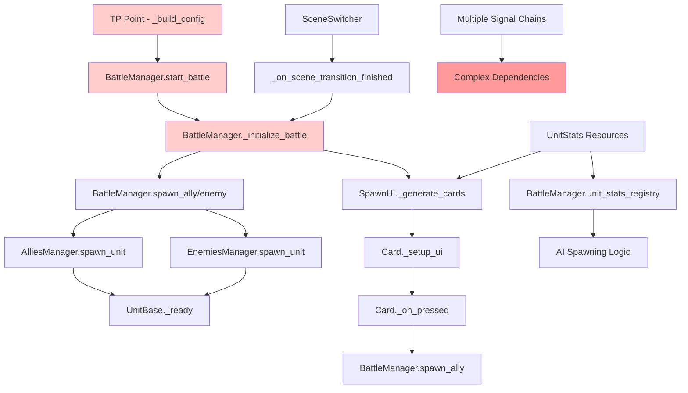
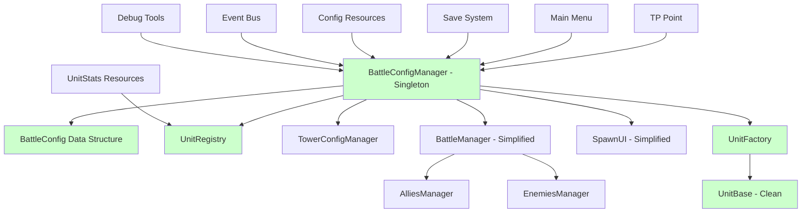

# Battle Configuration Flow Analysis

## Current Configuration Flow Investigation

This document analyzes the current unit and battle configuration flow in Project Terminus and proposes a centralized solution.

### Current "Sloppy" Configuration Flow



### Key Issues Identified

#### 1. Scattered Configuration Sources
Configuration comes from multiple places:
- `tp_point.gd` builds battle config dictionaries
- `UnitStats` resources loaded from filesystem
- Hardcoded values in multiple scripts
- Signal chains passing data indirectly

#### 2. Complex Signal Dependencies
- `SceneSwitcher.scene_transition_finished` → `_initialize_battle`
- `card_pressed` → `spawn_ally` → `spawn_unit`
- Multiple managers with overlapping responsibilities

#### 3. Tight Coupling
- `UnitBase` directly accesses `BattleManager.enemy_multiplyer`
- `SpawnUI` hardcodes resource paths
- Multiple managers need to know about each other

#### 4. Code Examples of Issues

**Direct Global Access (UnitBase.gd:44):**
```gdscript
if team == 1:
    current_health = int(stats.health * BattleManager.enemy_multiplyer)
```

**Hardcoded Resource Paths (SpawnUI.gd:27):**
```gdscript
var stats_dir = "res://resources/unit_stats/"
```

**Complex Configuration Building (tp_point.gd:28-43):**
```gdscript
func _build_config() -> Dictionary:
    return {
        "battle_id": battle_id,
        "battle_name": battle_name,
        "background_scene": background_scene,
        "music_track": music_track,
        "enemy_multiplyer": enemy_multiplyer,
        "ai_cooldown_min": ai_cooldown_min,
        "ai_cooldown_max": ai_cooldown_max,
        "starting_elixir": starting_elixir,
        "player_tower_hp": player_tower_hp,
        "enemy_tower_hp": enemy_tower_hp,
        "exp_reward_victory": exp_reward_victory,
        "crystal_reward_victory": crystal_reward_victory,
    }
```

## Proposed Centralized Configuration Solution

### Architecture Overview



### Core Components

#### 1. BattleConfigManager (Singleton)
**Purpose**: Central authority for all battle configuration

**Responsibilities**:
- Load and validate battle configurations
- Manage unit registry with caching
- Provide configuration to all systems
- Handle configuration overrides and debugging
- Maintain battle state and statistics

**Key Methods**:
```gdscript
func load_battle_config(battle_id: String) -> BattleConfig
func get_unit_stats(unit_id: String) -> UnitStats
func get_tower_config(team: int) -> TowerConfig
func apply_difficulty_multiplier(multiplier: float)
func validate_configuration() -> bool
```

#### 2. UnitFactory
**Purpose**: Centralized unit creation with proper configuration injection

**Benefits**:
- Eliminates scattered unit creation logic
- Consistent unit initialization
- Easy to extend with new unit types
- Centralized unit pooling for performance

**Key Methods**:
```gdscript
func create_unit(unit_id: String, team: int, lane: int) -> UnitBase
func create_unit_from_stats(stats: UnitStats, team: int, lane: int) -> UnitBase
func preload_unit_types(unit_ids: Array[String])
```

#### 3. Simplified Data Structures

**BattleConfig Class**:
```gdscript
class_name BattleConfig
extends Resource

@export var battle_id: String
@export var battle_name: String
@export var background_scene: PackedScene
@export var music_track: AudioStream
@export var enemy_multiplier: float = 1.0
@export var ai_cooldown_min: float = 2.0
@export var ai_cooldown_max: float = 5.0
@export var starting_elixir: float = 5.0
@export var player_tower_hp: int = 1000
@export var enemy_tower_hp: int = 1000
@export var exp_reward_victory: int = 100
@export var crystal_reward_victory: int = 50
@export var available_units: Array[String] = []
```

**UnitRegistry Class**:
```gdscript
class_name UnitRegistry
extends Resource

var unit_stats_cache: Dictionary = {}
var available_player_units: Array[String] = []
var available_enemy_units: Array[String] = []

func get_unit_stats(unit_id: String) -> UnitStats
func get_player_units() -> Array[UnitStats]
func get_enemy_units() -> Array[UnitStats]
func cache_unit_stats(unit_id: String, stats: UnitStats)
```

### Implementation Benefits

#### 1. Maintainability
- All configuration logic in one place
- Clear separation of concerns
- Easier to modify configuration rules
- Single point of change for configuration structure

#### 2. Testability
- Easy to mock and test configuration
- Isolated configuration logic
- Deterministic unit creation
- Simplified debugging

#### 3. Performance
- Reduced redundant loading and calculations
- Centralized caching
- Preloaded unit configurations
- Optimized resource management

#### 4. Flexibility
- Easy to add new configuration options
- Runtime configuration modification
- Mod-friendly architecture
- Configuration validation and error handling

## Migration Strategy

### Phase 1: Foundation
1. Create `BattleConfigManager` singleton
2. Implement `BattleConfig` and `UnitRegistry` classes
3. Set up basic configuration loading from existing resources

### Phase 2: Unit Creation
1. Implement `UnitFactory` class
2. Refactor `AlliesManager` and `EnemiesManager` to use UnitFactory
3. Update `UnitBase` to receive configuration via constructor

### Phase 3: UI Integration
1. Refactor `SpawnUI` to use unit registry
2. Update `Card` system to use centralized configuration
3. Simplify `BattleManager` configuration handling

### Phase 4: Cleanup
1. Remove scattered configuration access patterns
2. Eliminate redundant configuration loading
3. Add comprehensive error handling and validation
4. Update documentation and examples

### Example Migration Code

**Before (Current UnitBase.gd):**
```gdscript
func _ready():
    if stats:
        if team == 1:
            current_health = int(stats.health * BattleManager.enemy_multiplyer)
        else:
            current_health = stats.health
```

**After (Clean UnitBase.gd):**
```gdscript
func initialize(config: UnitConfig) -> void:
    stats = config.get_modified_stats()
    current_health = stats.max_health
    team = config.team
    lane = config.lane
```

**Before (Current BattleManager):**
```gdscript
func start_battle(config: Dictionary, return_scene: String = "main_world") -> void:
    current_config = config
    enemy_multiplyer = current_config.get("enemy_multiplyer", 1.0)
```

**After (Clean BattleManager):**
```gdscript
func start_battle(battle_config: BattleConfig, return_scene: String = "main_world") -> void:
    current_battle_config = battle_config
    BattleConfigManager.apply_battle_config(battle_config)
```

## Conclusion

The current configuration system suffers from scattered responsibilities, tight coupling, and complex signal chains. The proposed centralized solution addresses these issues by:

1. **Centralizing Configuration**: Single source of truth through BattleConfigManager
2. **Simplifying Dependencies**: Clear data flow with minimal coupling
3. **Improving Maintainability**: Easier to modify, test, and debug
4. **Enhancing Performance**: Reduced redundancy and better resource management
5. **Enabling Extensibility**: Easy to add new features and configuration options

This refactoring would significantly improve the codebase's architecture while maintaining all existing functionality and providing a solid foundation for future development.
