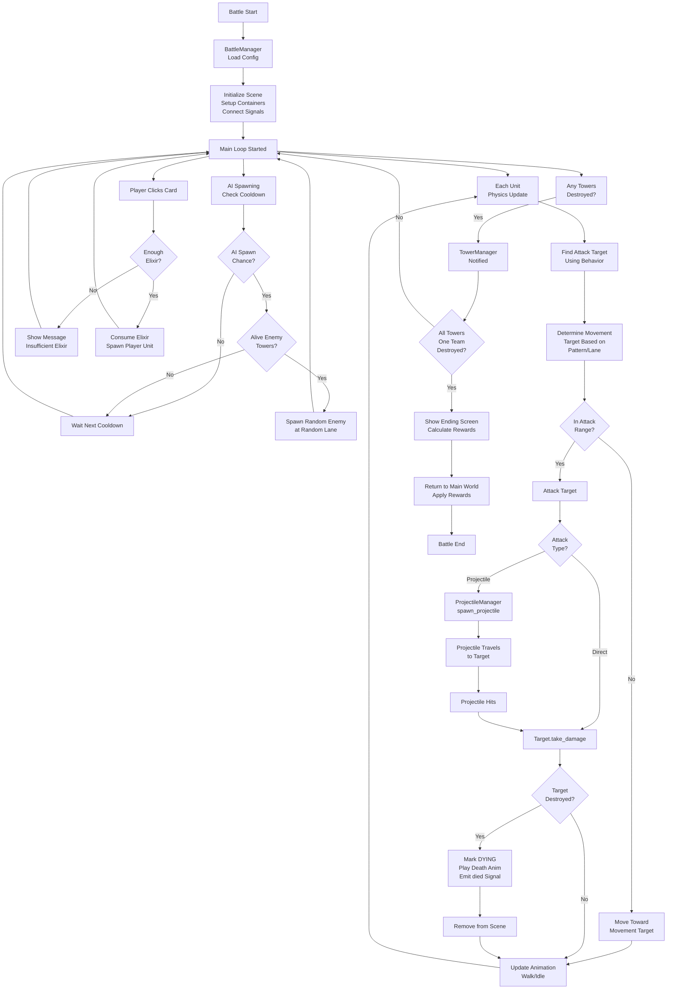

# Combat System Summary - Project Terminus

## System Overview

The combat system is a **lane-based tower defense battle system** where:
- **Player units** defend their towers by attacking enemy units and towers
- **Enemy units** (spawned by AI) march toward player towers
- **Victory** = Destroy all enemy towers
- **Defeat** = Destroy all player towers
- **Currency** = Elixir (consumed to spawn units)

---

## Core Architecture

### 1. Battle Managers (Orchestration Layer)

#### **BattleManager** (`scripts/battle/main/battle_manager.gd`)
- **Role**: Central orchestrator of all battle systems
- **Key Responsibilities**:
  - Loads battle configuration (enemy multiplier, AI settings, starting elixir)
  - Manages scene initialization and cleanup
  - Orchestrates AI spawning system
  - Tracks battle statistics (time, damage dealt, enemies killed)
  - Handles game ending and rewards

- **Key Methods**:
  - `start_battle(config, return_scene)` - Initialize battle with config dict
  - `get_spawn_point(team, lane)` - Returns spawn position for units
  - `spawn_ally(stats, lane)` - Player spawns unit (consumes elixir)
  - `spawn_enemy(stats, lane)` - AI spawns enemy unit
  - `_process_ai_spawning(delta)` - AI loop: checks cooldown, spawns random enemies
  - `show_ending_screen(winning_team)` - Display results screen

- **Key Properties**:
  - `game_state: GameState` - IDLE, READY, GAME_OVER
  - `current_config: Dictionary` - Battle settings
  - `unit_stats_registry: Dictionary` - Loaded enemy unit stats (by ID)
  - `ai_enabled, ai_cooldown_min/max` - AI configuration
  - `enemy_multiplyer` - Difficulty scaling for enemy health

#### **TowerManager** (`scripts/battle/tower/tower_manager.gd`)
- **Role**: Tracks tower health and game end conditions
- **Key Methods**:
  - `_register_all_towers()` - Scan scene for all tower nodes
  - `_check_game_end()` - Verify victory/defeat conditions
  - `_on_tower_destroyed(tower)` - Handle tower destruction
  
- **Key Signals**:
  - `tower_destroyed_notify(tower)` - A tower was destroyed (for debug)
  - `all_towers_destroyed(winning_team)` - Game end: someone lost all towers

- **State Tracking**:
  - `towers: Array` - List of all towers
  - `player_towers: int` - Count of player towers still alive
  - `enemy_towers: int` - Count of enemy towers still alive

### 2. Unit Management Layer

#### **AlliesManager** (`scripts/battle/unit/allies_manager.gd`)
- **Role**: Spawn and manage player-controlled units
- **Features**:
  - Validates spawn position and elixir cost
  - Signals unit_spawned for UI updates
  - Sets default behavior pattern (ATTACK_NEAREST_ENEMY)
  - Adds units to groups ("units", "ally_units")

#### **EnemiesManager** (`scripts/battle/unit/enemies_manager.gd`)
- **Role**: Spawn and manage AI-controlled units
- **Features**:
  - Spawns enemy units at random lanes
  - Flips sprite for enemy team direction
  - No cost validation (AI spawning is free)
  - Adds units to groups ("units", "enemy_units")

#### **UnitBase** (`scripts/battle/unit/unit_base.gd`)
- **Role**: Individual unit behavior and combat logic
- **Key Methods**:
  - `_physics_process(delta)` - Main unit loop:
    1. Find target using behavior pattern
    2. Determine movement target
    3. Approach and attack if in range
    4. Update animation (walk/idle/attack)
  - `_find_target()` - Behavior-driven target selection
  - `_handle_combat(target, move_target)` - Attack if in range, move toward goal
  - `_perform_attack(target)` - Execute attack (direct or projectile)
  - `_move_towards(target_pos)` - Move using velocity

- **Key Properties**:
  - `stats: UnitStats` - Unit data (health, damage, speed, attack distance)
  - `team: Team` - PLAYER or OPPONENT
  - `lane: int` - Lane assignment (0-2)
  - `behavior_pattern: BehaviorPattern` - Targeting/movement strategy
  - `lifecycle_state: LifecycleState` - ALIVE, DYING, DEAD
  - `current_target: Node` - Active attack target

- **Key Signals**:
  - `health_changed(current, max)` - Update health bar
  - `died(unit)` - Unit death (for cleanup)
  - `enemy_killed(target)` - Unit killed an enemy
  - `damage_dealt(amount, target)` - Track battle stats

#### **BehaviorPattern** (`scripts/battle/unit/behavior_pattern.gd`)
- **Role**: Encapsulates unit AI logic
- **Pattern Types**:
  - `ATTACK_NEAREST_ENEMY` - Default (find closest enemy, march toward lane goal)
  - `FOLLOW_PLAYER` - Track player unit specifically
  - `DEFEND_TOWER` - Protect friendly tower

### 3. Tower System

#### **TowerBase** (`scripts/battle/tower/tower_base.gd`)
- **Role**: Individual tower with health and destruction
- **Key Methods**:
  - `take_damage(amount, attacker)` - Apply damage (reduced by defense)
  - `_destroy()` - Mark destroyed, remove restriction area, signal destruction

- **Key Properties**:
  - `team: Team` - PLAYER or OPPONENT
  - `max_health, current_health` - Tower durability
  - `is_destroyed: bool` - Destruction flag
  - `defense: int` - Damage reduction
  - `_restriction_area: Area2D` - Prevents player units from getting too close to enemy towers

- **Key Signals**:
  - `tower_destroyed(tower)` - Signal to TowerManager
  - `health_changed(current, max)` - Update UI

### 4. Projectile System

#### **ProjectileManager** (`scripts/battle/main/projectile_manager.gd`)
- **Role**: Spawn and manage projectiles
- **Method**: `spawn_projectile(shooter, target)` - Create projectile instance
- **Projectile Behavior**:
  - Tracks from shooter position to target
  - Applies damage on hit
  - Team-aware (only damages enemy team)

### 5. UI Layer

#### **SpawnUI** (`scripts/battle/ui/spawn_ui.gd`)
- **Role**: Display unit spawn cards and handle player input
- **Features**:
  - Auto-generates cards from player unit stats
  - Hotkey input (1-9 for quick spawn)
  - Toggles visibility (Tab key)
  - Filters available units based on game logic

#### **ElixirUI** (`scripts/battle/ui/elixir_ui.gd`)
- **Role**: Manage and display elixir (spawn currency)
- **Features**:
  - Track current elixir amount
  - Consume elixir on unit spawn
  - Regenerate elixir over time
  - Signal updates to UI

#### **MessageManager** & **EndingScreen**
- Display notifications and final game results

---

## Combat Flow Diagram



---

## Known Bug: Enemies Spawn on Destroyed Towers - FIXED ✅

### Problem (Now Resolved)
Enemy units were occasionally spawning directly on destroyed towers due to a race condition in the tower destruction and AI spawning systems.

### Root Cause (Detailed Analysis)
**Race Condition Timeline:**
1. Tower takes lethal damage: `_destroy()` called
2. Sets `is_destroyed = true`, then calls `queue_free()`
3. **Critical Issue**: `queue_free()` defers deletion to next frame
4. Tower still exists in scene tree and "towers" group during current frame
5. `_process_ai_spawning()` runs same frame, queries `get_tree().get_nodes_in_group("towers")`
6. Finds destroyed tower still in group
7. Timing issues could cause spawn attempts on invalid towers

### Solution Implemented (Multi-Layer Approach) ✅

**Layer 1: Immediate Group Removal**
- Tower removed from "towers" group immediately in `_destroy()`
- Prevents group queries from finding the destroyed tower
- Happens before `queue_free()` takes effect

**Layer 2: Enhanced Spawn Validation**
- Added `_get_alive_enemy_towers()` helper with multiple safety checks:
  - Validates `is_destroyed` flag
  - Checks `is_queued_for_deletion()`
  - Verifies `is_instance_valid()`
  
**Layer 3: Spawn Position Validation**
- Enhanced `spawn_enemy()` with zero-position checks
- Validates spawn position before instantiation

**Layer 4: AI Spawning Early Exit**
- `_process_ai_spawning()` checks for alive towers before attempting spawn
- Prevents unnecessary spawn attempts when no towers available

### Files Modified
- `scripts/battle/tower/tower_base.gd` - Immediate group removal on destruction
- `scripts/battle/main/battle_manager.gd` - Enhanced spawn validation and early exits
- `docs/BUGS_ARCHIVED.md` - Comprehensive bug documentation and solution

### Result
✅ Race condition eliminated through immediate group removal
✅ Multiple validation layers catch edge cases
✅ No spawn attempts on destroyed towers
✅ Cleaner code flow with explicit validation

**Full details in:** [`BUGS_ARCHIVED.md - Bug 16`](BUGS_ARCHIVED.md#bug-16-enemies-spawning-from-destroyed-towers-race-condition---fixed)

---

## Data Flow Architecture

### Configuration
```
BattleTransitionManager
  └─> current_config: Dictionary
       ├─ enemy_units: Array[String]  // Unit IDs to spawn
       ├─ starting_elixir: int
       ├─ ai_cooldown_min/max: float
       └─ background_scene: PackedScene
```

### Unit Stats (Resources)
```
resources/unit_stats/
  ├─ ally_archer.tres → UnitStats
  │   ├─ unit_id: String
  │   ├─ health: int
  │   ├─ attack_damage: int
  │   ├─ attack_speed: float
  │   ├─ move_speed: float
  │   ├─ attack_distance: float
  │   ├─ cost: int (elixir)
  │   └─ attack_type: AttackType (DIRECT/PROJECTILE)
  └─ ...
```

### Signals Flow
```
TowerManager
  └─> tower_destroyed_notify(tower)
  └─> all_towers_destroyed(winning_team) ──> BattleManager.show_ending_screen()

UnitBase
  ├─> health_changed(current, max) ──> HealthBar UI
  ├─> died(unit) ──> Cleanup
  ├─> damage_dealt(amount, target) ──> BattleManager.on_unit_damage_dealt()
  └─> enemy_killed(target) ──> BattleManager.on_unit_enemy_killed()

ElixirUI
  └─> elixir_changed(amount) ──> Update UI Display

SpawnUI
  └─> card_pressed ──> BattleManager.spawn_ally()
```

---

## Optimization Opportunities

1. **Object Pooling**: Reuse unit and projectile instances instead of instantiate/free
2. **Spatial Partitioning**: Optimize target finding with quadtrees instead of scene tree queries
3. **Update Batching**: Group unit updates instead of individual _physics_process calls
4. **Behavior Tree**: Replace pattern switching with proper behavior tree for complex AI
5. **Caching**: Cache tower lists instead of querying scene tree every frame

---

## Testing Recommendations

1. **Tower Destruction Edge Cases**:
   - Rapid tower destruction (multiple towers same frame)
   - Verify no spawns on destroyed towers
   - Verify proper game end detection

2. **AI Spawning**:
   - Test with all enemy towers alive
   - Test with 1 tower alive
   - Test with tower destroyed mid-spawn
   - Verify spawn position is valid

3. **Combat Scenarios**:
   - Multi-lane unit battles
   - Projectile vs direct attacks
   - Rapid unit spawning
   - Game ending correctly for both win/loss

---

**Last Updated:** May 2, 2026  
**Status:** Bug identified and solution planned
