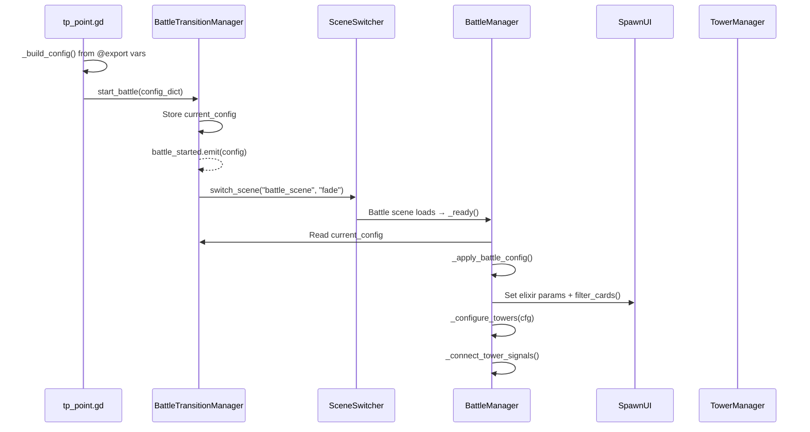
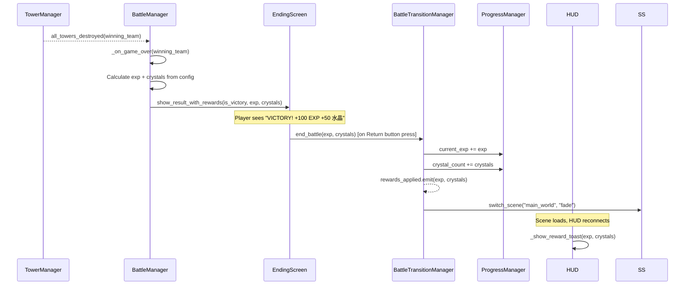
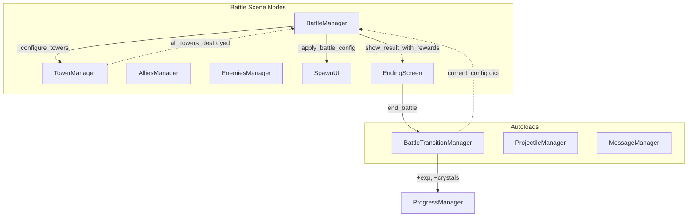

# Battle Scene Transition System: test_project ↔ battle_system_test

Comprehensive plan for handling the **forward transition** (world → battle: init look & stats) and **return transition** (battle → world: calculate exp & crystals), with a full registry of every new/modified function, signal, and script.

## Background & Current State

### test_project (World/RPG side)
- **Autoloads**: `SceneSwitcher`, `GuiManager`, `CutsceneManager`, `ProgressManager`
- **Scene switching**: `SceneSwitcher.switch_scene(name, transition)` loads `.tscn` from `res://scenes/` inside a `SceneContainer` node under the root `Game` node.
- **Player progression**: `ProgressManager` tracks `current_exp`, `crystal_count`, stages, memories, skills.
- **Battle trigger**: `tp_point.gd` calls `SceneSwitcher.switch_scene(battlefield_name, "fade")` — it passes **no context** (no level data, no difficulty, no enemy config).
- **Return from battle**: `back_to_world.gd` calls `SceneSwitcher.switch_scene("main_world", "fade")` — again, **no result data** is passed back.

### battle_system_test (Battle side)
- **Autoloads**: `MessageManager`, `ProjectileManager`
- **Core manager**: `BattleManager` (not an autoload — it's a scene-level `_ready()` script that finds nodes on `current_scene`)
- **Ending flow**: `TowerManager._check_game_end()` → `_end_game(winning_team)` → `all_towers_destroyed.emit()` + direct call to `show_ending_screen()`
- **Existing bridge**: `BattleWorldLink` has stub methods and signals (`world_data_synced`, `battle_result_submitted`) but they're **completely unimplemented**.
- **No reward calculation**: No exp/crystal logic exists.

### Key Problems to Solve
1. **No data flows between projects** — tp_point just does a scene switch with no payload.
2. **BattleManager expects to be root scene** — it calls `get_tree().current_scene` to find nodes.
3. **No reward/result system** — battle ends with `get_tree().paused = true` and nothing returns.
4. **Ending screen** has `reload_current_scene` and non-existent `change_scene_to_file("main_menu")` — doesn't integrate with `SceneSwitcher`.
5. **BattleWorldLink** is a dead stub.
6. **HUD's `coin_counter`** is disconnected from `ProgressManager.crystal_count` — they are the same currency and must be synced.

---

## Resolved Design Decisions

### ✅ Single-Project Integration
The battle system will be **integrated into `test_project`**. The scene from `battle_system_test/scenes/Main.tscn` will become `test_project/scenes/battle_scene.tscn` and be loadable via `SceneSwitcher`.

### ✅ BattleConfig as Inline @export Vars on tp_point
**No separate `.tres` resource files.** All battle configuration fields are `@export` variables directly on `tp_point.gd`. Each `tp_point` instance in `main_world.tscn` is configured via the Godot Inspector — the values are saved inline in the `.tscn` file. A lightweight `Dictionary` is built at runtime and passed to `BattleTransitionManager`.

### ✅ Simplified Return: Direct Function Call with Two Ints
**No `BattleResult` class. No `BattleTracker` node.** The return flow is a single direct function call:
```
BattleTransitionManager.end_battle(exp_earned, crystals_earned)
```
The battle scene calculates the final reward values itself (using the config it received), then passes just two integers. `BattleTransitionManager` applies them to `ProgressManager` and switches back to the world. A `rewards_applied` signal is emitted so the HUD can show a toast.

### ✅ Autoload Changes
- `ProjectileManager` and `MessageManager` become autoloads in `test_project`.
- A new `BattleTransitionManager` autoload orchestrates the forward/return flow.

### ✅ Random AI Spawning (No Waves)
Keep the current random AI spawning system. No wave-based enemy system.

### ✅ Crystal Count Rename
`hud.gd`'s `coin_counter` will be **removed** and replaced with direct reads from `ProgressManager.crystal_count`. They are the same currency.

---

## Proposed Changes

### Component 1: BattleTransitionManager (New Autoload)

The **orchestrator** — sits between ProgressManager and SceneSwitcher, holds config across scene transitions. Minimal state: just a dictionary of battle settings and a return scene name.

---

#### [NEW] `important_scripts/battle_transition_manager.gd`

```gdscript
extends Node

## --- Signals ---
signal battle_started(config: Dictionary)
signal rewards_applied(exp_earned: int, crystals_earned: int)

## --- State ---
var current_config: Dictionary = {}
var _return_scene: String = "main_world"

## --- Forward Transition: World → Battle ---
## Called by tp_point.gd with a config dictionary built from its @export vars.
func start_battle(config: Dictionary, return_scene: String = "main_world") -> void:
    current_config = config
    _return_scene = return_scene
    battle_started.emit(config)
    SceneSwitcher.switch_scene("battle_scene", "fade")

## --- Return Transition: Battle → World ---
## Called by ending_screen.gd with final calculated values.
func end_battle(exp_earned: int, crystals_earned: int) -> void:
    ProgressManager.current_exp += exp_earned
    ProgressManager.crystal_count += crystals_earned
    rewards_applied.emit(exp_earned, crystals_earned)
    print("[BattleTransition] Applied: +%d EXP, +%d Crystals" % [exp_earned, crystals_earned])
    SceneSwitcher.switch_scene(_return_scene, "fade")
```

**Functions:**

| Function | Purpose |
|---|---|
| `start_battle(config, return_scene)` | Stores config dict, emits `battle_started`, triggers scene switch |
| `end_battle(exp_earned, crystals_earned)` | Applies rewards to ProgressManager, emits `rewards_applied`, returns to world |

**Signals:**

| Signal | Parameters | When Emitted | Listeners |
|---|---|---|---|
| `battle_started(config)` | `Dictionary` | Before scene switch to battle | (Future: analytics, save) |
| `rewards_applied(exp, crystals)` | `int, int` | After ProgressManager updated, before scene switch back | HUD for reward toast |

---

### Component 2: tp_point.gd — Inline Battle Configuration

All battle config fields are `@export` vars on the teleport point itself. Each instance in `main_world.tscn` gets its own values via the Inspector.

---

#### [MODIFY] `other_scripts/tp_point.gd`

```gdscript
extends AnimatedSprite2D

## --- Battle Identity ---
@export var battle_id: String = ""
@export var battle_name: String = ""

## --- Visual / Scene Setup ---
@export var background_scene: PackedScene
@export var background_color: Color = Color(0.15, 0.15, 0.2)
@export var music_track: AudioStream

## --- AI Enemy Configuration ---
@export var ai_cooldown_min: float = 2.0
@export var ai_cooldown_max: float = 5.0
@export var ai_spawn_chance: float = 1.0

## --- Player Constraints ---
@export var starting_elixir: float = 5.0
@export var max_elixir: int = 10
@export var elixir_regen_rate: float = 1.0
@export var allowed_unit_ids: Array[String] = []

## --- Tower Stats ---
@export var player_tower_hp: int = 1000
@export var enemy_tower_hp: int = 1000

## --- Reward Configuration ---
@export var exp_reward_victory: int = 100
@export var exp_reward_defeat: int = 20
@export var crystal_reward_victory: int = 50
@export var crystal_reward_defeat: int = 5
@export var bonus_crystal_per_tower_alive: int = 10
@export var bonus_exp_per_unit_killed: int = 5

func _on_area_2d_body_entered(_body: Node2D) -> void:
    BattleTransitionManager.start_battle(_build_config())

func _build_config() -> Dictionary:
    return {
        "battle_id": battle_id,
        "battle_name": battle_name,
        "background_scene": background_scene,
        "background_color": background_color,
        "music_track": music_track,
        "ai_cooldown_min": ai_cooldown_min,
        "ai_cooldown_max": ai_cooldown_max,
        "ai_spawn_chance": ai_spawn_chance,
        "starting_elixir": starting_elixir,
        "max_elixir": max_elixir,
        "elixir_regen_rate": elixir_regen_rate,
        "allowed_unit_ids": allowed_unit_ids,
        "player_tower_hp": player_tower_hp,
        "enemy_tower_hp": enemy_tower_hp,
        "exp_reward_victory": exp_reward_victory,
        "exp_reward_defeat": exp_reward_defeat,
        "crystal_reward_victory": crystal_reward_victory,
        "crystal_reward_defeat": crystal_reward_defeat,
        "bonus_crystal_per_tower_alive": bonus_crystal_per_tower_alive,
        "bonus_exp_per_unit_killed": bonus_exp_per_unit_killed,
    }
```

---

### Component 3: Battle Scene Initialization

How the battle scene reads the config dictionary and configures itself.

---

#### [MODIFY] `battle_manager.gd` (from `battle_system_test`, integrated into test_project)

Major changes to read from `BattleTransitionManager.current_config`:

```diff
 func _ready() -> void:
     curr = get_tree().current_scene
+    _apply_battle_config()
+    _connect_tower_signals()
     ...

+func _apply_battle_config() -> void:
+    var cfg = BattleTransitionManager.current_config
+    if cfg.is_empty():
+        push_warning("No battle config set — using defaults")
+        return
+    
+    # Apply AI settings
+    AI_COOLDOWN_MIN = cfg.get("ai_cooldown_min", 2.0)
+    AI_COOLDOWN_MAX = cfg.get("ai_cooldown_max", 5.0)
+    AI_SPAWN_CHANCE = cfg.get("ai_spawn_chance", 1.0)
+    
+    # Apply tower HP
+    _configure_towers(cfg)
+    
+    # Apply elixir settings
+    if elixir:
+        elixir.max_elixir = cfg.get("max_elixir", 10)
+        elixir.current = cfg.get("starting_elixir", 5.0)
+        elixir.regen_per_sec = cfg.get("elixir_regen_rate", 1.0)
+    
+    # Filter available cards
+    var allowed: Array = cfg.get("allowed_unit_ids", [])
+    if not allowed.is_empty():
+        _filter_cards(allowed)
+    
+    # Apply background
+    var bg_scene = cfg.get("background_scene")
+    if bg_scene:
+        _load_background(bg_scene)

+func _configure_towers(cfg: Dictionary) -> void:
+    for tower in get_tree().get_nodes_in_group("towers"):
+        if tower.team == Team.PLAYER:
+            tower.max_health = cfg.get("player_tower_hp", 1000)
+            tower.current_health = tower.max_health
+        else:
+            tower.max_health = cfg.get("enemy_tower_hp", 1000)
+            tower.current_health = tower.max_health

+func _filter_cards(allowed_ids: Array) -> void:
+    if elixir and elixir.has_method("filter_cards"):
+        elixir.filter_cards(allowed_ids)

+func _load_background(scene: PackedScene) -> void:
+    var bg_container = curr.get_node_or_null("Background")
+    if bg_container:
+        for child in bg_container.get_children():
+            child.queue_free()
+        bg_container.add_child(scene.instantiate())

+func _connect_tower_signals() -> void:
+    var tm = curr.get_node_or_null("Towers")
+    if tm and tm.has_signal("all_towers_destroyed"):
+        tm.all_towers_destroyed.connect(_on_game_over)

+func _on_game_over(winning_team: int) -> void:
+    get_tree().paused = true
+    var cfg = BattleTransitionManager.current_config
+    var is_victory = (winning_team == Team.PLAYER)
+    
+    # Calculate rewards here
+    var exp_earned: int = 0
+    var crystals_earned: int = 0
+    
+    if is_victory:
+        exp_earned = cfg.get("exp_reward_victory", 100)
+        crystals_earned = cfg.get("crystal_reward_victory", 50)
+    else:
+        exp_earned = cfg.get("exp_reward_defeat", 20)
+        crystals_earned = cfg.get("crystal_reward_defeat", 5)
+    
+    # Bonuses
+    crystals_earned += _count_player_towers() * cfg.get("bonus_crystal_per_tower_alive", 10)
+    exp_earned += _count_enemy_units_killed() * cfg.get("bonus_exp_per_unit_killed", 5)
+    
+    # Pass to ending screen
+    _show_ending_with_rewards(is_victory, exp_earned, crystals_earned)

+func _show_ending_with_rewards(is_victory: bool, exp: int, crystals: int) -> void:
+    var es = curr.get_node_or_null("UI/EndingScreen")
+    if es and es.has_method("show_result_with_rewards"):
+        es.show_result_with_rewards(is_victory, exp, crystals)

+func _count_player_towers() -> int:
+    var count = 0
+    for t in get_tree().get_nodes_in_group("towers"):
+        if t.team == Team.PLAYER and not t.is_destroyed:
+            count += 1
+    return count

+func _count_enemy_units_killed() -> int:
+    # Count by checking how many enemy units have been freed
+    # Simple approach: track via AlliesManager signal or group delta
+    return 0  # TODO: wire up kill counter (see Component 4 note)
```

**New functions added to BattleManager:**

| Function | Purpose |
|---|---|
| `_apply_battle_config()` | Reads `BattleTransitionManager.current_config` dict, configures all subsystems |
| `_configure_towers(cfg)` | Sets tower HP from config |
| `_filter_cards(allowed_ids)` | Restricts which unit cards are available |
| `_load_background(scene)` | Swaps background tilemap/scene |
| `_connect_tower_signals()` | Connects `all_towers_destroyed` → `_on_game_over` |
| `_on_game_over(winning_team)` | Calculates final exp/crystals, passes to ending screen |
| `_show_ending_with_rewards(...)` | Forwards calculated rewards to `EndingScreen` |
| `_count_player_towers()` | Counts surviving player towers for bonus calculation |
| `_count_enemy_units_killed()` | Counts enemy kills for bonus calculation (needs kill counter wiring) |

---

#### [MODIFY] `spawn_ui.gd`

```diff
+func filter_cards(allowed_ids: Array) -> void:
+    for card in active_cards:
+        if card.unit_stats and card.unit_stats.unit_id not in allowed_ids:
+            card.queue_free()
+    active_cards = active_cards.filter(func(c): return is_instance_valid(c))
```

---

### Component 4: Game End & Return to World

How the ending screen shows rewards and triggers the return.

---

#### [MODIFY] `tower_manager.gd`

Replace direct `show_ending_screen()` call with signal-only flow:

```diff
 func _end_game(winning_team: int):
     all_towers_destroyed.emit(winning_team)
-
-    var scene_root = get_tree().current_scene
-    if scene_root and scene_root.has_method("show_ending_screen"):
-        scene_root.show_ending_screen(winning_team)
+    # BattleManager listens for all_towers_destroyed and handles the ending flow
+    # through BattleTransitionManager — no direct call needed here
```

---

#### [MODIFY] `ending_screen.gd`

Replace `reload_current_scene` / `change_scene_to_file` with `BattleTransitionManager` calls. The ending screen now receives pre-calculated rewards and displays them. On button press, it calls `end_battle(exp, crystals)` directly.

```gdscript
extends Control

enum Team { PLAYER = 0, OPPONENT = 1 }

@export var win_color: Color = Color.GREEN
@export var lose_color: Color = Color.RED

@onready var result_label: Label = $BackgroundPanel/VBoxContainer/ResultLabel
@onready var exp_label: Label = $BackgroundPanel/VBoxContainer/ExpLabel
@onready var crystal_label: Label = $BackgroundPanel/VBoxContainer/CrystalLabel
@onready var background: Panel = $BackgroundPanel

var _pending_exp: int = 0
var _pending_crystals: int = 0

func _ready():
    process_mode = Node.PROCESS_MODE_ALWAYS
    visible = false

## Called by BattleManager with pre-calculated reward values
func show_result_with_rewards(is_victory: bool, exp_earned: int, crystals_earned: int) -> void:
    _pending_exp = exp_earned
    _pending_crystals = crystals_earned
    visible = true
    
    if is_victory:
        result_label.text = "VICTORY!"
        result_label.modulate = win_color
    else:
        result_label.text = "DEFEAT"
        result_label.modulate = lose_color
    
    if exp_label:
        exp_label.text = "+%d EXP" % exp_earned
    if crystal_label:
        crystal_label.text = "+%d 水晶" % crystals_earned

func _on_restart_pressed():
    get_tree().paused = false
    BattleTransitionManager.start_battle(BattleTransitionManager.current_config)

func _on_return_pressed():
    get_tree().paused = false
    BattleTransitionManager.end_battle(_pending_exp, _pending_crystals)
```

---

### Component 5: World-Side Crystal Sync & Reward Feedback

Unify `coin_counter` with `ProgressManager.crystal_count` and show rewards after battle.

---

#### [MODIFY] `hud.gd`

```diff
 extends Control

-var coin_counter := 0
-
 @onready var gems_label: Label = $MarginContainer/HBoxContainer/gems
 @onready var hud_button: Button = $MarginContainer/HBoxContainer/Button
+@onready var reward_label: Label   # Add a Label node: HUD/MarginContainer/HBoxContainer/RewardLabel

 func _ready() -> void:
     hud_button.pressed.connect(_on_hud_button_pressed)
-    _refresh_gems_label()
+    _refresh_crystal_label()
     self.visible = true
+    ProgressManager.data_updated.connect(_refresh_crystal_label)
+    BattleTransitionManager.rewards_applied.connect(_show_reward_toast)

 func _on_hud_button_pressed() -> void:
-    set_coin(coin_counter + 1)
-
-func set_coin(amount: int) -> void:
-    coin_counter = amount
-    _refresh_gems_label()
+    ProgressManager.crystal_count += 1
+    ProgressManager.data_updated.emit()

-func _refresh_gems_label() -> void:
-    gems_label.text = "水晶數量: %d" % coin_counter
+func _refresh_crystal_label() -> void:
+    gems_label.text = "水晶數量: %d" % ProgressManager.crystal_count

+func _show_reward_toast(exp_earned: int, crystals_earned: int) -> void:
+    if reward_label:
+        reward_label.text = "+%d EXP  +%d 水晶" % [exp_earned, crystals_earned]
+        reward_label.show()
+        await get_tree().create_timer(3.0).timeout
+        reward_label.hide()
```

#### [MODIFY] `world_ui.gd`

```diff
 extends CanvasLayer

 @onready var hud: Control = $HUD
 @onready var pause_menu: Control = $Pause

-func set_coin(amount: int) -> void:
-    hud.set_coin(amount)
+# set_coin removed — HUD now reads directly from ProgressManager.crystal_count
```

---

### Component 6: project.godot Updates

---

#### [MODIFY] `project.godot`

```diff
 [autoload]
 SceneSwitcher="*res://important_scripts/scene_switcher.gd"
 GuiManager="*res://important_scripts/gui_manager.gd"
 CutsceneManager="*res://important_scripts/cutscene_manager.gd"
 ProgressManager="*res://important_scripts/progress_manager.gd"
+BattleTransitionManager="*res://important_scripts/battle_transition_manager.gd"
+ProjectileManager="*res://important_scripts/battle/projectile_manager.gd"
+MessageManager="*res://important_scripts/battle/ui/message_manager.gd"
```

---

### Deleted Scripts (2 files)

| # | Script | Reason |
|---|---|---|
| 1 | `back_to_world.gd` | Replaced by ending screen's `_on_return_pressed()` → `BattleTransitionManager.end_battle()` |
| 2 | `battle_world_link.gd` | Replaced by `BattleTransitionManager` |

---

## Complete Addition Registry

### New Scripts (1 file)

| # | Script | Type | Location |
|---|---|---|---|
| 1 | `battle_transition_manager.gd` | Autoload singleton | `important_scripts/` |

### New Signals (2 signals)

| # | Signal | Defined In | Parameters | Purpose |
|---|---|---|---|---|
| 1 | `battle_started(config)` | `BattleTransitionManager` | `Dictionary` | Notify systems of battle entry |
| 2 | `rewards_applied(exp, crystals)` | `BattleTransitionManager` | `int, int` | Notify HUD to show reward toast |

### New Functions (14 functions)

| # | Function | Script | Purpose |
|---|---|---|---|
| 1 | `start_battle(config, return_scene)` | `BattleTransitionManager` | Entry point: stores config, switches to battle scene |
| 2 | `end_battle(exp_earned, crystals_earned)` | `BattleTransitionManager` | Applies rewards to PM, emits signal, returns to world |
| 3 | `_build_config()` | `tp_point` | Builds config Dictionary from @export vars |
| 4 | `_apply_battle_config()` | `BattleManager` | Reads config dict, configures AI/towers/elixir/cards |
| 5 | `_configure_towers(cfg)` | `BattleManager` | Sets tower HP from config |
| 6 | `_filter_cards(allowed_ids)` | `BattleManager` | Restricts available unit cards |
| 7 | `_load_background(scene)` | `BattleManager` | Swaps background scene |
| 8 | `_connect_tower_signals()` | `BattleManager` | Connects `all_towers_destroyed` → `_on_game_over` |
| 9 | `_on_game_over(winning_team)` | `BattleManager` | Calculates final exp/crystals, shows ending screen |
| 10 | `_show_ending_with_rewards(...)` | `BattleManager` | Forwards values to EndingScreen |
| 11 | `filter_cards(allowed_ids)` | `SpawnUI` | Removes cards not in allowed list |
| 12 | `show_result_with_rewards(is_victory, exp, crystals)` | `EndingScreen` | Shows victory/defeat + reward values |
| 13 | `_on_return_pressed()` | `EndingScreen` | Calls `BattleTransitionManager.end_battle(exp, crystals)` |
| 14 | `_show_reward_toast(exp, crystals)` | `HUD` | Displays "+EXP +Crystal" on return to world |

### Modified Scripts (8 files)

| # | Script | Key Changes |
|---|---|---|
| 1 | `battle_manager.gd` | Add config reading, tower signal connection, reward calculation, game-over handling |
| 2 | `spawn_ui.gd` | Add `filter_cards()` |
| 3 | `tower_manager.gd` | Remove direct `show_ending_screen` call, rely on signal |
| 4 | `ending_screen.gd` | Full rewrite: show rewards preview, use `BattleTransitionManager` for return |
| 5 | `tp_point.gd` | Full rewrite: inline @export config vars, build dict, use `BattleTransitionManager` |
| 6 | `hud.gd` | Remove `coin_counter`, sync with `ProgressManager.crystal_count`, add reward toast |
| 7 | `world_ui.gd` | Remove `set_coin()` |
| 8 | `project.godot` | Add 3 new autoloads |

### Deleted Scripts (2 files)

| # | Script | Reason |
|---|---|---|
| 1 | `back_to_world.gd` | Replaced by ending screen's `_on_return_pressed()` |
| 2 | `battle_world_link.gd` | Replaced by `BattleTransitionManager` |

---

## Signal & Data Flow Diagrams

### Forward Flow: World → Battle



### Return Flow: Battle → World



### Battle Scene Internal Connections



---

## Verification Plan

### Automated Tests
1. Run project from Godot editor — verify no parse errors on load
2. `grep -r "back_to_world\|battle_world_link\|coin_counter\|set_coin"` across test_project to ensure all old references removed
3. Verify all 7 autoloads are listed in `project.godot`

### Manual Verification
1. **Forward transition**: Walk into a `tp_point` in `main_world` → verify battle loads with correct config (tower HP, elixir values, available cards)
2. **Gameplay**: Play a battle to completion (victory + defeat paths)
3. **Return transition**: Click "Return" on ending screen → verify:
   - Scene switches back to `main_world`
   - `ProgressManager.current_exp` increased by expected amount
   - `ProgressManager.crystal_count` increased by expected amount
   - HUD shows reward toast with correct "+EXP +水晶" values
   - HUD gem counter reflects new crystal_count
   - Backpack UI reflects new exp/stage progression
4. **Restart**: Click "Restart" on ending screen → verify battle reinitializes with same config
5. **Multiple tp_points**: Verify different tp_point instances in main_world have different config values in Inspector
